# 🏗️ ArchitectIQ

<p align="center">

**AI Architecture Review & Optimization Platform for AI Agents**

Analyze production AI architectures, estimate infrastructure costs, detect architectural risks, and generate executive-level optimization reports with actionable recommendations.

</p>

<p align="center">


</p>

---

# 🌐 Live Demo

### 🚀 Frontend

**https://architectiq-liard.vercel.app**

### 📖 API Documentation

**https://architectiq-liard.vercel.app/#docs**

### ⚙️ Backend API

**https://architectiq.onrender.com**

---

# ✨ What is ArchitectIQ?

Modern AI systems consist of multiple interconnected components—LLMs, embedding models, vector databases, RAG pipelines, caching layers, observability stacks, and production infrastructure.

Evaluating whether an AI architecture is **production-ready** often requires significant engineering expertise.

ArchitectIQ automates this process by acting as an **AI Architecture Auditor**. It analyzes an AI stack, identifies architectural bottlenecks, estimates infrastructure costs, evaluates production readiness, and generates an executive-level report with prioritized optimization recommendations.

Designed for **AI Engineers**, **Developers**, **Startups**, and **AI Agents**, ArchitectIQ transforms raw architecture configurations into actionable engineering insights.

---

# 🚀 Features

## 🔍 Architecture Analysis

- Production Readiness Assessment
- Architecture Health Score
- Architecture Grade
- AI Maturity Analysis
- Executive Summary

---

## 💰 Cost Intelligence

- Monthly AI Cost Estimation
- Token Usage Analysis
- Embedding Cost
- Vector Database Cost
- Infrastructure Cost
- Estimated Monthly Savings

---

## 🛡️ Production Audit

- Security Review
- Reliability Analysis
- Scalability Assessment
- Latency Analysis
- RAG Quality Review
- Observability Review

---

## 💡 Recommendation Engine

Generates prioritized recommendations with

- Priority
- Reason
- Expected Cost Savings
- Latency Improvements
- Difficulty
- Estimated Implementation Time

---

## 🛣 Optimization Roadmap

Automatically builds phased implementation plans including

- Quick Wins
- Performance Improvements
- Production Hardening

---

## 🤖 AI Agent Ready

ArchitectIQ exposes REST APIs specifically designed for AI agents.

Agents can directly request

- Architecture Reviews
- Cost Estimation
- Production Analysis
- Optimization Recommendations

and receive structured JSON responses.

---

# 📸 Screenshots

## 🏠 Landing Page

### Hero Section

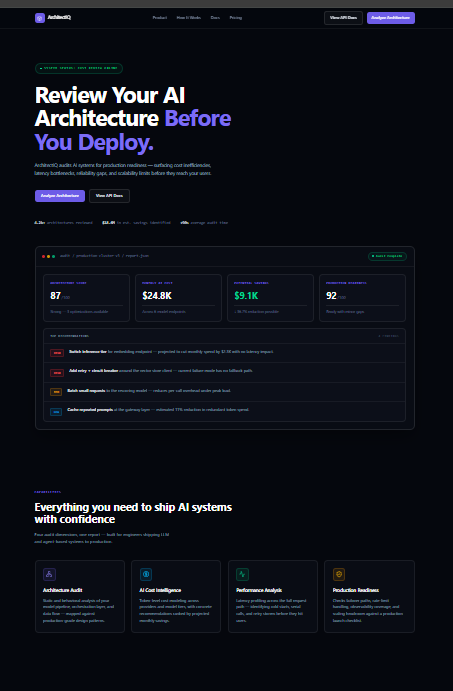

---

### Features & Architecture

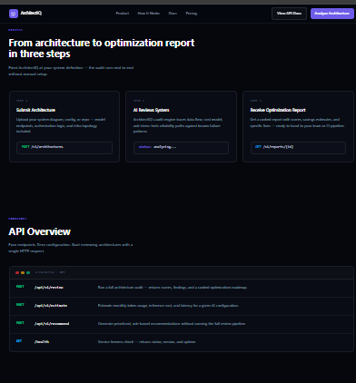

---

### AI Agent Ready API

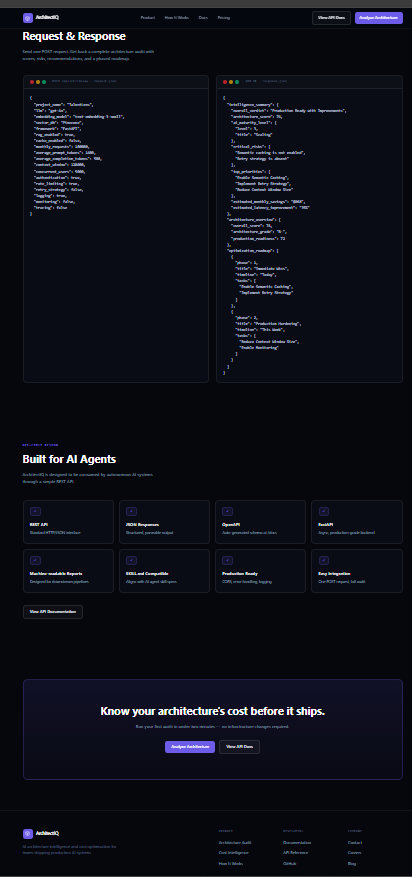

---

# 📝 Architecture Review

Configure your AI architecture by selecting models, vector databases, frameworks, production scale, security controls, and infrastructure settings.

### Review Configuration

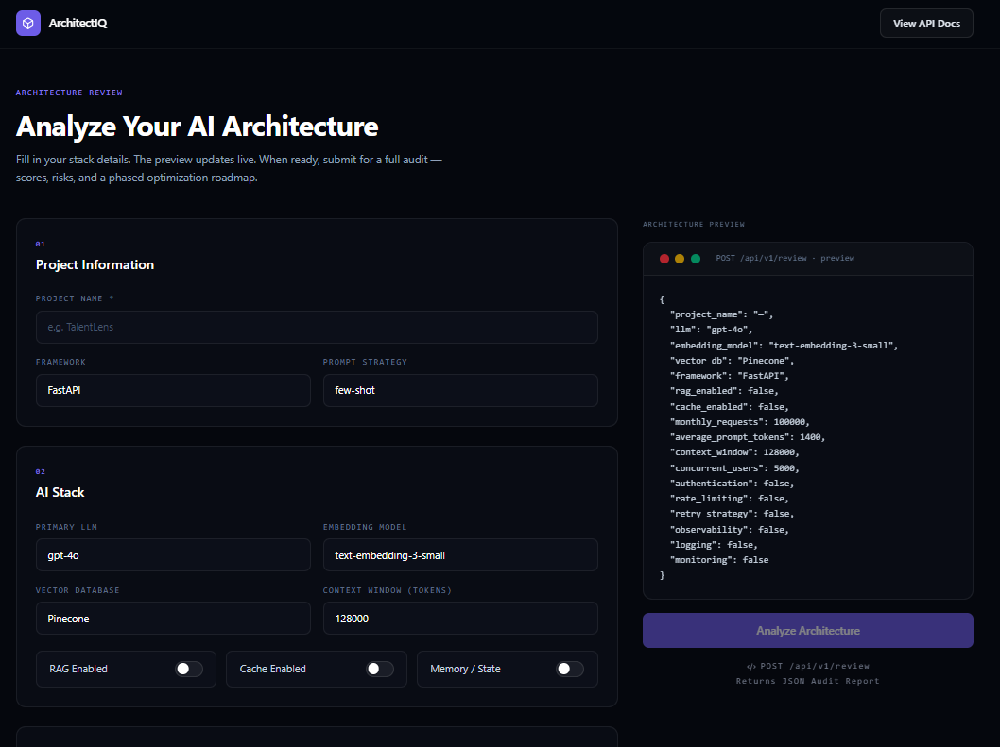

---

### Production Settings

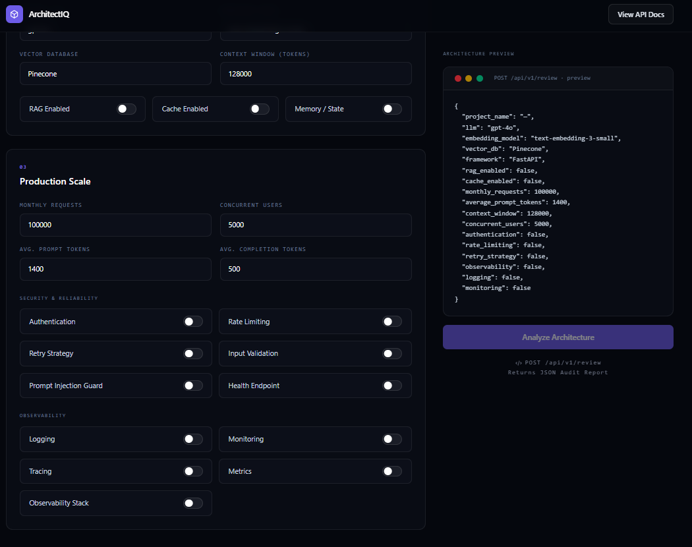

---

# ⚙️ Analysis Pipeline

ArchitectIQ analyzes the submitted architecture through multiple specialized analyzers before generating the final report.

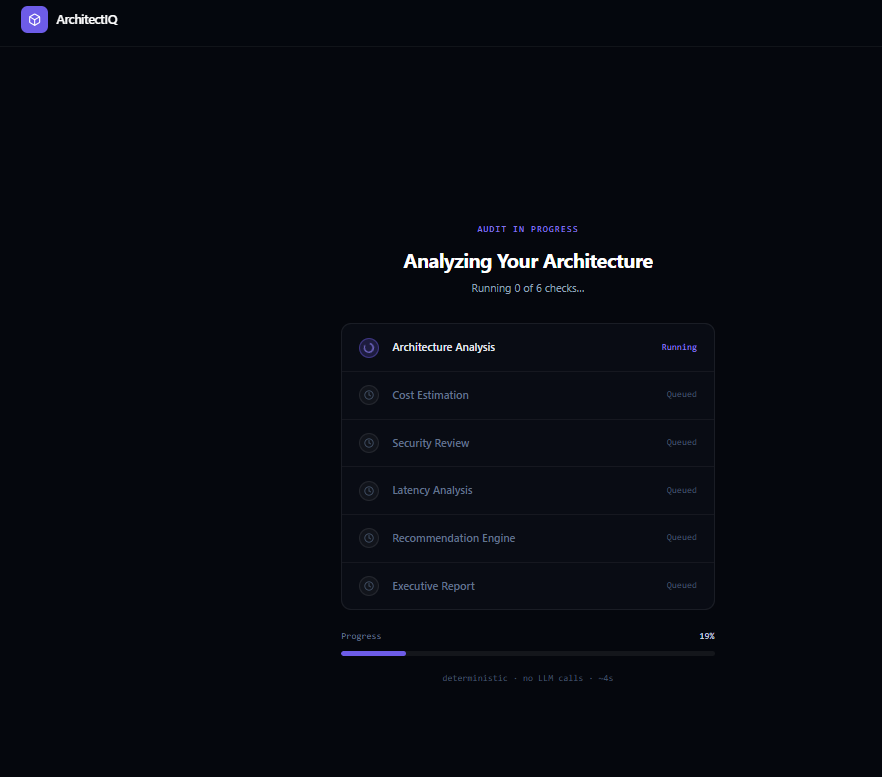

---

# 📊 Executive Architecture Report

### Executive Summary

Production readiness, architecture health, AI cost estimation, and executive insights.

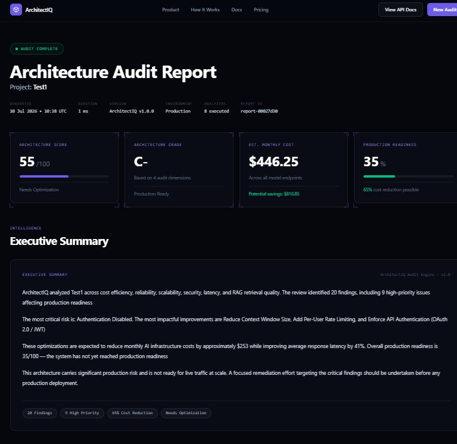

---

### Critical Risks & Recommendations

Prioritized production findings and optimization recommendations.

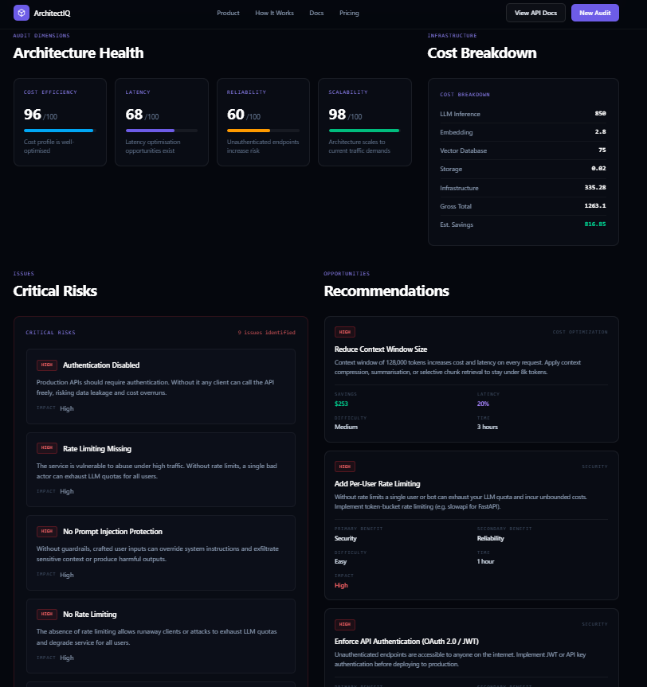

---

### Optimization Roadmap

Automatically generated implementation roadmap for improving production AI systems.

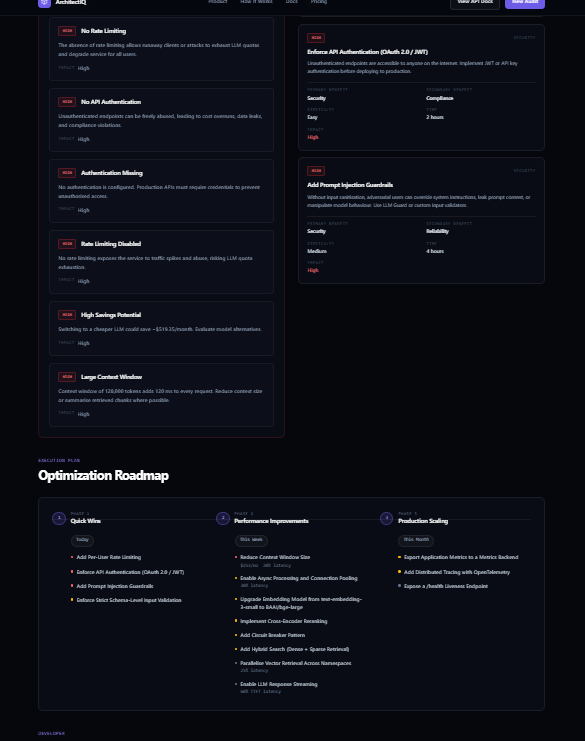

---

### AI Agent JSON Response

Structured JSON response optimized for AI agent consumption.

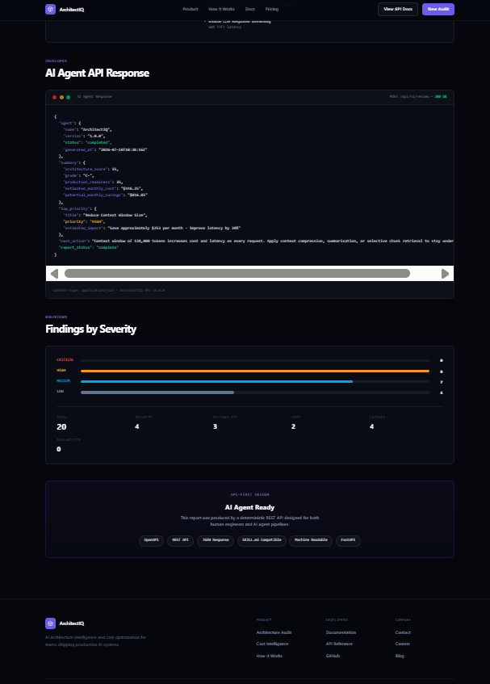

---

# 🏗️ System Architecture

High-level architecture showing the interaction between the frontend, backend, analysis engines, and recommendation engine.

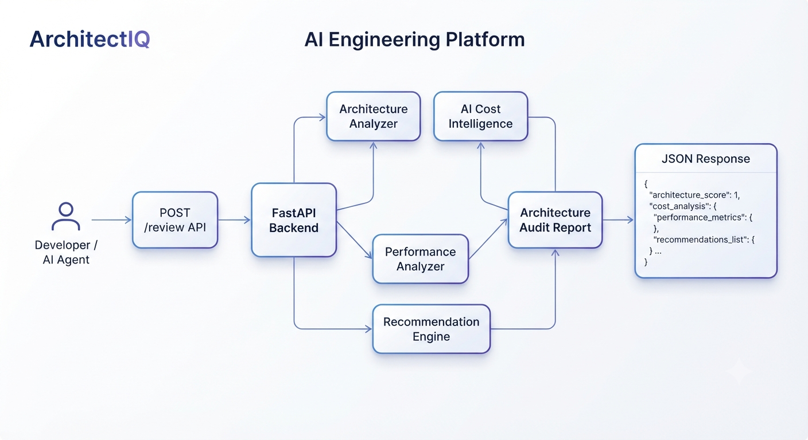

---

# 🔄 API Flow

End-to-end request lifecycle from architecture submission to executive report generation.

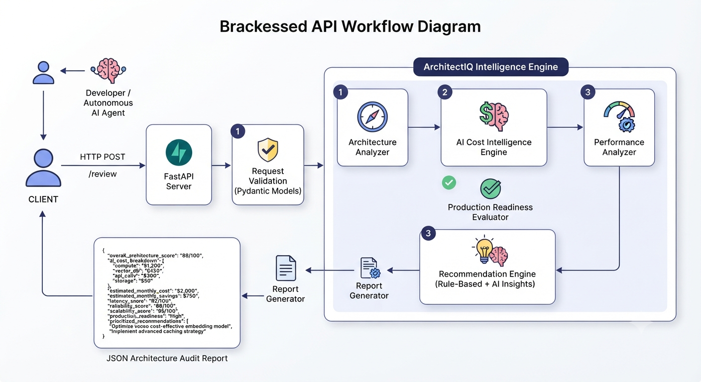

---

# 🧠 Architecture Pipeline

```text
                User / AI Agent
                       │
                       ▼
          Submit Architecture Configuration
                       │
                       ▼
                FastAPI REST API
                       │
     ┌─────────────────┼──────────────────┐
     │                 │                  │
     ▼                 ▼                  ▼
Architecture      Cost Estimator     Recommendation
 Analyzer                              Engine
     │                 │                  │
     └─────────────────┼──────────────────┘
                       ▼
             Executive Summary Generator
                       │
                       ▼
           Optimization Roadmap Generator
                       │
                       ▼
         Structured JSON Executive Report
```

---

# 🔌 REST API

| Method | Endpoint | Description |
|----------|----------------------|-------------------------------------------|
| GET | `/health` | Health Check |
| POST | `/api/v1/review` | Complete AI Architecture Audit |
| POST | `/api/v1/estimate` | Monthly AI Cost Estimation |
| POST | `/api/v1/recommend` | Generate Optimization Recommendations |

---

# ⚡ Example Workflow

```text
Developer / AI Agent

        │

        ▼

Submit AI Architecture

        │

        ▼

Architecture Analysis

        │

        ▼

Cost Estimation

        │

        ▼

Security & Reliability Audit

        │

        ▼

Recommendation Engine

        │

        ▼

Executive Summary

        │

        ▼

Optimization Roadmap

        │

        ▼

JSON Report
```

---

# 🛠️ Tech Stack

## Frontend

- React
- TypeScript
- Vite
- TailwindCSS

---

## Backend

- FastAPI
- Python
- Pydantic

---

## Deployment

- Vercel
- Render

---

# 📂 Project Structure

```text
ArchitectIQ
│
├── backend/
│
├── frontend/
│
├── screenshots/
│
├── README.md
│
└── SKILL.md
```

---

# 🚀 Running Locally

## Backend

```bash
cd backend

pip install -r requirements.txt

uvicorn app.main:app --reload
```

Backend runs on

```
http://localhost:8000
```

---

## Frontend

```bash
cd frontend

npm install

npm run dev
```

Frontend runs on

```
http://localhost:5173
```

---

# 💼 Use Cases

- AI Architecture Reviews
- GenAI Cost Optimization
- RAG Pipeline Auditing
- LLM Infrastructure Evaluation
- Production Readiness Assessment
- AI Agent Decision Support
- Startup AI Stack Reviews
- AI Engineering Best Practices

---

# 🎯 Why ArchitectIQ?

Building production AI systems requires balancing **performance**, **cost**, **reliability**, **security**, and **scalability**.

ArchitectIQ helps engineering teams by automatically:

- Detecting production bottlenecks
- Estimating AI infrastructure costs
- Identifying security and reliability risks
- Prioritizing optimization opportunities
- Generating executive-ready reports
- Producing structured JSON outputs for AI agents

---

# 🚀 Future Roadmap

- User Authentication
- Historical Audit Dashboard
- PDF Report Export
- Multi-project Workspaces
- GitHub Integration
- CI/CD Architecture Reviews
- Team Collaboration
- AI Agent-to-Agent Architecture Reviews

---

# 📄 License

MIT License

---

# 👩‍💻 Author

### **Shreya Dubey**

Built with ❤️ for AI Engineers, Developers, Startups, and AI Agents.

If you found this project useful, consider giving it a ⭐ on GitHub!
